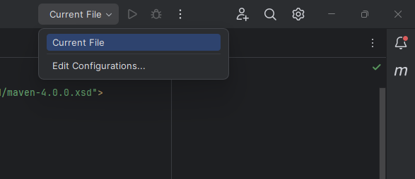
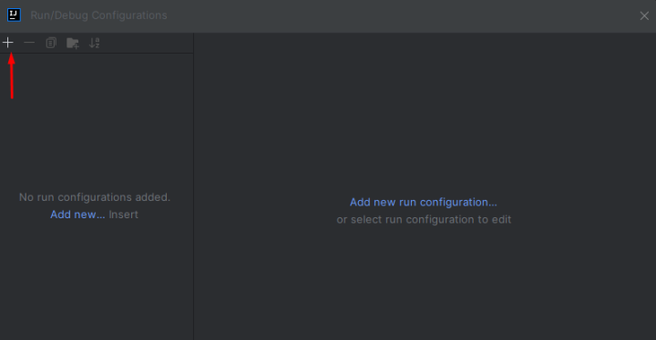
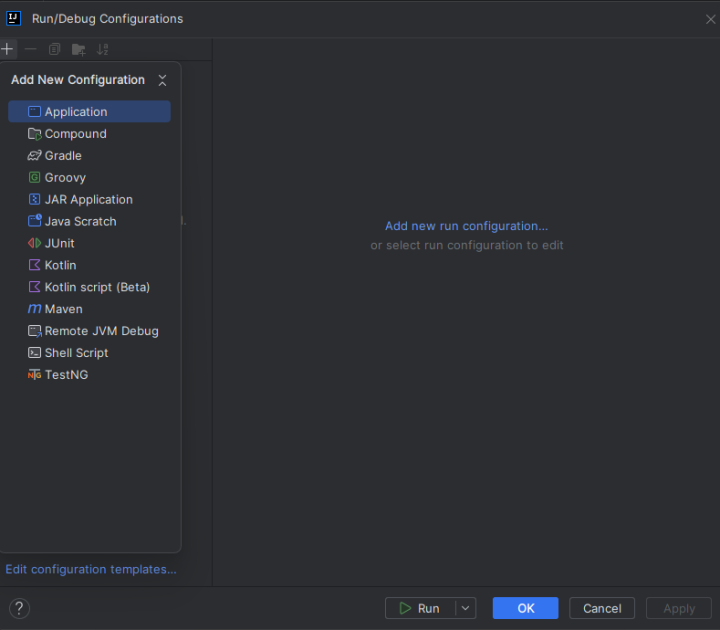
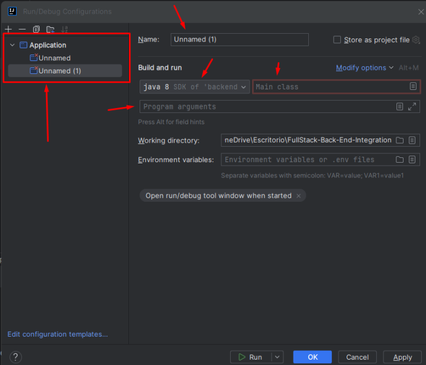

# Proyecto de Aplicación Backend

## Tabla de Contenidos

- [Proyecto de Aplicación Backend](#proyecto-de-aplicación-backend)
  - [Tabla de Contenidos](#tabla-de-contenidos)
  - [Resumen](#resumen)
  - [Configuración y Ejecución](#configuración-y-ejecución)
    - [Requisitos Previos](#requisitos-previos)
    - [Pasos para la Configuración](#pasos-para-la-configuración)
    - [Ejecución de la Aplicación](#ejecución-de-la-aplicación)
    - [Configuración con Intellij IDEA :](#configuración-con-intellij-idea-)
  - [](#)
  - [Construido con:](#construido-con)
  - [Funcionalidades Clave](#funcionalidades-clave)

## Resumen

Esta herramienta de línea de comando backend está diseñada para analizar archivos Java, describiendo atributos y métodos de clases de manera dinámica. Este documento proporciona instrucciones detalladas sobre cómo instalar y ejecutar la aplicación backend.

## Configuración y Ejecución

### Requisitos Previos

Antes de ejecutar esta aplicación, asegúrate de tener instalados los siguientes componentes:

- Java Development Kit (JDK) 1.8.0
- Apache Maven 3.8.5
- Un IDE compatible con proyectos Maven, como IntelliJ IDEA

### Pasos para la Configuración

1. Clona el repositorio del proyecto backend en tu máquina local usando:

```bash
git clone https://github.com/YhonaPeguero/V1-back-end
```

2. Navega al directorio del proyecto:

```bash
cd V1-back-end
```

3. Asegúrate de que la configuración de tu IDE apunte a la versión correcta del JDK (1.8.0) y Maven (3.8.5).

### Ejecución de la Aplicación

### Configuración con Intellij IDEA :

En la esquina superior derecha, haz clic en la opción disponible (puede aparecer como "Main", "Unnamed", entre otros nombres).

A continuación, selecciona "Edit configurations". 
IMG DE REFERENCIA:



Hacer Clic en el signo de mas:



Luego en Application :



Después de crear dos aplicaciones, procedemos con la configuración de las mismas:

Para ambas aplicaciones, se debe especificar la versión de Java como 1.8.0 y establecer el "Class name" a: org.example.Main.

En el campo "Main Class", ingresa: org.example.Main.

En "Program arguments", introduce los siguientes valores:

Para la primera aplicación, usa: person.txt.

Para la segunda aplicación, que llamaremos "API", utiliza en "Program arguments": server.


---
Una vez completadas estas configuraciones, puedes proceder a realizar pruebas tanto de la API, consumiéndola desde el front-end a través de la interfaz de usuario, como de la aplicación de línea de comandos (CLI). Esta última te permitirá ejecutar el programa de manera local. Esta flexibilidad facilita el desarrollo y la integración, permitiéndote validar el funcionamiento de ambas aplicaciones en un entorno de desarrollo

Una vez configurado el proyecto, puedes compilar y empaquetar la aplicación con el siguiente comando Maven:

```bash
mvn clean package
```

Para ejecutar la aplicación y analizar un archivo de clase Java, usa:

```bash
java -jar target/backend-1.0-SNAPSHOT.jar person.txt
```

Reemplaza `person.txt` con la ruta al archivo de texto que contiene la definición de la clase Java que deseas analizar.

## Construido con:

- **Back-end**:
  - Java (1.8.0)
  - Maven (3.8.5)
  - IntelliJ IDEA

## Funcionalidades Clave

- Análisis de archivos de clase Java para extraer y describir información de atributos y métodos.
- Salida formateada que muestra detalles de la clase de forma estructurada y legible.
